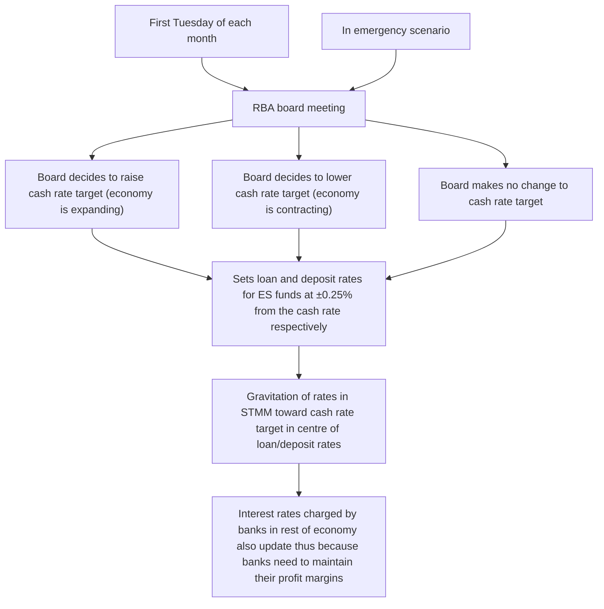
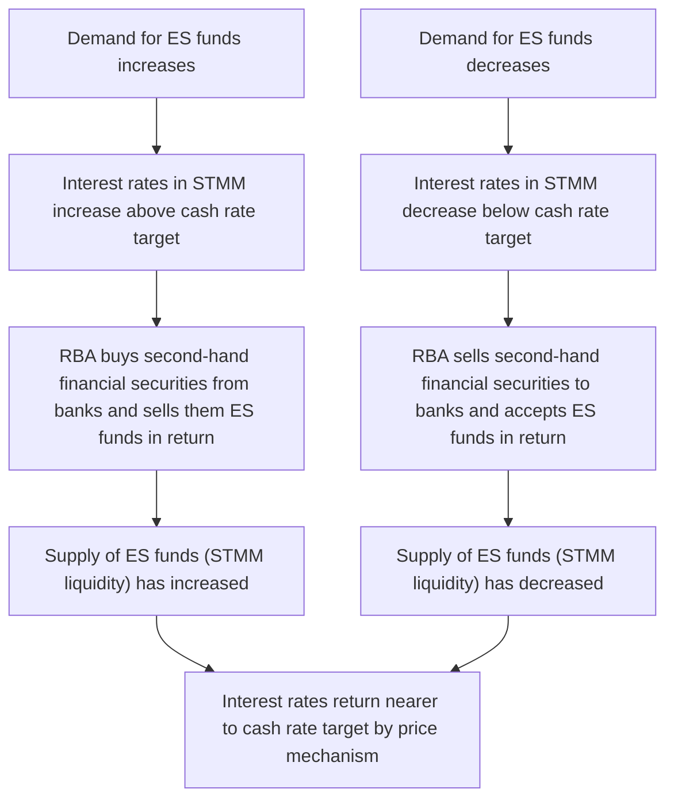
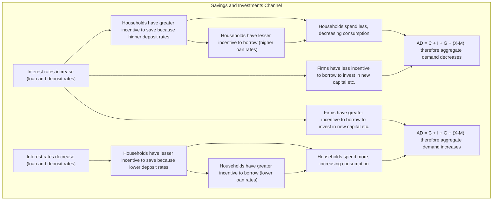
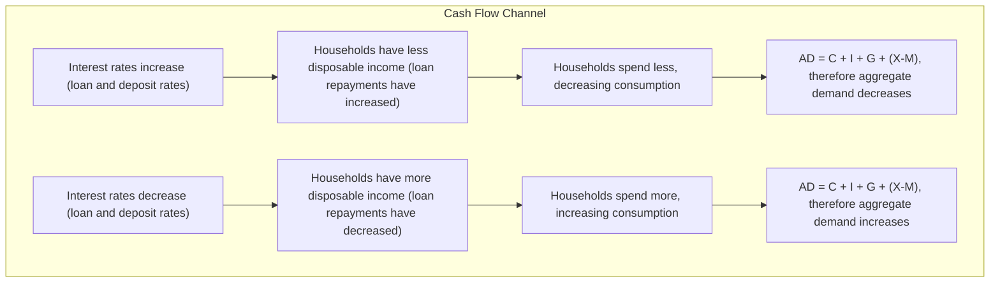
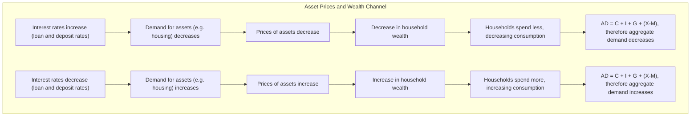
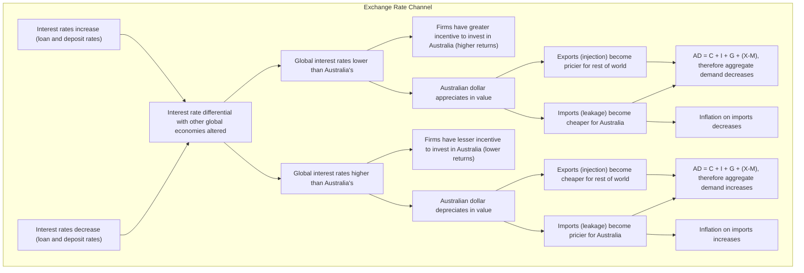

# RBA Monetary Policy

This document outlines the various stages of the Reserve bank of Australia's typical implementation of traditional monetary policy to influence interest rates in the economy and thus exert some control over aggregate demand, enabling counter-cyclical macroeconomic policy as per Keynesian theory. It should be rendered on a platform like [StackEdit](https://stackedit.io) for the best experience.

## Cash Rate Target and the Policy Interest Rate Corridor

Once the loan and deposit rates for ES funds have been set, banks will be unable to set their own loan rates higher than the RBA, as the borrower of course seeks the rate on the loan given to them to be as low as possible. If the RBA offers a lower rate, it will be taken. By the same principal, if the RBA offers a higher rate for a deposit, it will be taken. Thus, interest rates in the short-term money market should always be between ±0.25% of the cash rate target. Further, they will gravitate towards said target due to the contrasting pressures of borrowers looking for the lowest loan rate and depositors looking for the highest deposit rate. Thus, the RBA uses competition to keep interest rates in the short-term money market within target.

## Open Market Operations

## Transmission Mechanism

Note that the first stage of transmission mechanism, by which interest rates from banks are affected by the cash rate target set by the RBA is detailed in the above section on the policy interest rate corridor. This section details the second stage of the transmission mechanism, by which interest rates affect output, aggregate demand, inflation, unemployment, etc.

These four stages lead to one of two outcomes, that aggregate demand increases or decreases (possibly with a few extra effects along the way). This change in AD can be represented by the below diagram, which shows the aggregate demand and aggregate supply curves at their typical theoretical alignment. As per the principles of supply and demand, inflation and GDP growth (output growth) will follow logically as the equilibrium point between these two curves changes.

*Image courtesy: Wikipedia (https://upload.wikimedia.org/wikipedia/commons/thumb/2/25/AS_%2B_AD_graph.svg/1200px-AS_%2B_AD_graph.svg.png)*
